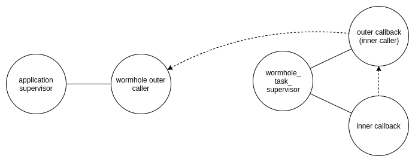
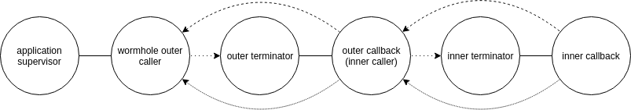

## Difference between v1 and v2

### Version 1
In v1 there was single supervisor called `wormhole_task_supervisor`.
All wormhole callbacks were supervised by it.
It is pretty naive design decision because it prevents cascading timeouts.
For example, if this code is executed:
```
Wormhole.capture(fn ->
  Wormhole.capture(fn ->
    :timer.sleep :infinity
  end)
end, timeout: 500)
```

process topology like this is created
(solid line represents link and dashed represents callback response path):



Outer callback times-out after 500 ms but its process continues to run for full
5 s, which is default timeout for inner callback.
Inner process continues to run forever.

### Version 2

In v2 the issue is resolved by removing single dedicated supervisor.
Each time `Wormhole.capture()` is called, new pair of processes is spawned.

Previous example generates topology like this
(solid and dashed lines represent link and callback response path respectively
and dotted line represents "monitored by" relation):



When outer caller times-out after 500 ms it terminates its (outer)
callback process which is at the same time inner process also.
Inner terminator (which is monitoring inner caller process) gets notified and
terminates itself and inner callback process (with which it is linked).
Same logic propagate any number of levels down the "wormhole tree".
